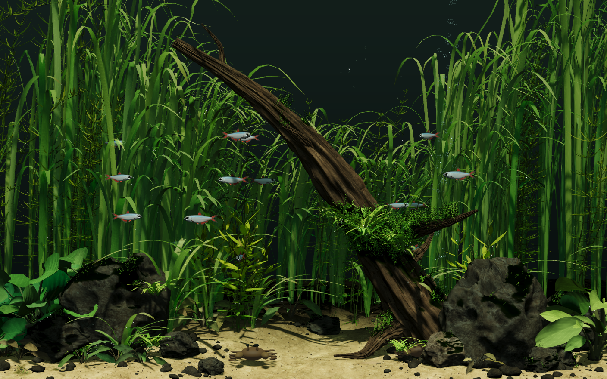

# Stillwater

A native C++ desktop aquarium. The first scene translates the procedural Riverscape
from [Desktop Habitats](https://github.com/chaseleantj/desktop-habitats), with retained
3D objects, Metal rendering, local glass-tap reactions, and original synthesized sound.

This is a working first prototype. It carries the reference's actual geometry and
surface textures into a new renderer; its lighting and fish behavior are not yet an
exact reproduction. There is no image-generation content, video backdrop, web view,
Swift, SwiftUI, or CloudKit in the app.

The renderer uses a compact camera-local surface registry, memoryless temporary
targets on Apple GPUs, and a specialized foliage shader. The default remains
4× MSAA at 24 fps. See [camera storage](docs/CAMERA_REGISTRY.md) and
[render-cost measurements](docs/RENDER_COSTS.md) for measured results and limits.

The source, scene archive, textures, upstream notices and diagnostic tools are
included in this standalone repository. No sibling checkout or external service
is required. Original Stillwater code is [MIT licensed](LICENSE).



## Run

On macOS with Xcode command-line tools, CMake 3.22 or newer, and a Metal-capable
GPU. Apple Silicon is the measured target; other Macs are not yet validated:

```sh
git clone https://github.com/falseywinchnet/stillwater.git
cd stillwater
python3 tools/check_assets.py
cmake -S . -B build -DCMAKE_BUILD_TYPE=Release
cmake --build build -j4
ctest --test-dir build --output-on-failure
open build/Stillwater.app --args --preview --muted
```

Launch without `--preview` for desktop placement. Click **◉** in the macOS menu
bar to open Stillwater's dropdown: pause/resume, sound, leaf surface grain, pointer reactions,
window/desktop placement, and quit. There is no floating control strip.
The preview's right-click menu exposes the same actions.

- Click the preview to tap the glass and startle nearby fish.
- Desktop mode always passes clicks and drags through to Finder, with the aquarium
  below desktop icons. Moving the pointer near a fish can startle it without
  capturing clicks; slow movements and a resting pointer leave it calm.
- **Fish react to pointer** toggles this behavior in either placement. A per-fish
  cooldown prevents repeated flight restarts, and foreground window bounds suppress
  reactions while working in another app. No global input monitor is installed.
- **Leaf surface grain** toggles the shared 2K fine-noise material. Pause first
  to compare the same frame. Broad foreground leaves receive the full treatment;
  other resolved leaves receive half strength and very thin leaves fade to smooth.
  `--no-leaf-grain` starts with the treatment off. See [materials](docs/MATERIALS.md).
- The aquarium never becomes a keyboard target. There are no Escape,
  Space, letter-key, or Command-Q handlers, and no menu keyboard shortcuts.
- Closing the preview returns it to the desktop.
- `--muted` starts silently. `--fps 1..60` changes the animation rate; default 24.
- Optional profiling controls: `--msaa 2` reduces coverage samples, and
  `--render-scale 0.75` reduces each internal image dimension. Defaults remain
  four samples and full internal size (capped at 1600 pixels wide).

The host currently uses the main display. It does not install a login item, change
system wallpaper settings, monitor global input, or request screen recording access.
The compiled app is a local development build, not a notarized distribution.

## What persists

The scene retains about 9,600 objects, 16 fish, two crabs, a bubble emitter, geometry,
material textures, and per-object GPU records. Construction and upload happen once.
Fish trajectories and plant bending are evaluated on the GPU from retained parameters.
A glass tap changes only nearby creature records; moving a plant or rock changes one
instance record. The static shadow map is cached. Moving shadows refresh at 16 Hz or
on an edit. Explicit pause stops the frame timer and ambient audio.

The fixed camera view now retains depth, surface identity, world shading positions,
and material/lighting coefficients for sand, rocks, wood and other fixed imported
surfaces. A separate cache retains direct-light visibility at those surfaces until
the shadow map changes. Moving plants and animals rasterize against the retained
depth each frame, preserving occlusion and newly exposed background. Caustics still
animate at the original frame rate. `--full-redraw` selects the comparison renderer.

Moving a fixed object conservatively rebuilds the fixed-view cache; moving a plant
does not. Light intensity changes reuse the caches. The final composition still
covers the whole view: local tile repair, receiver-specific shadow invalidation,
exact moving-object picking, collision-aware fish routes, and a deeper environment
remain development work. CPU, GPU, compositor and memory costs are measured
separately; see [the retained experiment](docs/RETAINED_VISIBILITY.md) and
[performance measurements](docs/PERFORMANCE.md).

## Source and art

Application, sound, scene ownership, input, and platform integration are C++20.
Metal shaders run on the GPU. A small typed C++ boundary calls macOS's Objective-C
runtime; AppKit is still the native window service, without Objective-C++ source.

The upstream procedural geometry is translated **offline** into a versioned mesh
archive by `tools/translate_riverscape.mjs`. The original MIT source is vendored
verbatim with hashes. Node and Three.js are developer-side asset tools only; neither
is needed to build from the checked-in archive or to run the app. The geometry
builders have not all been rewritten in C++. Rebuild the archive with:

```sh
node tools/translate_riverscape.mjs
cmake --build build --target stillwater_assets
```

The archive contains positions, normals, material coordinates, current-response
parameters, instances, and object identities—not rendered pictures. Conventional
Poly Haven CC0 albedo/normal maps provide the wood, rock, and sand surfaces.
See [third-party credits](THIRD_PARTY.md), [engine design](docs/ENGINE.md),
[the house style](docs/PROGRAMMING_HOUSE_STYLE.md), and [BFFT review](docs/BFFT_REVIEW.md).

## Diagnostics

Python image comparisons use Pillow. Native verification needs a logged-in macOS
GUI session with Metal; CI builds the macOS app and tests portable scene/sound
logic, but does not claim GPU image validation on a hosted runner.

```sh
python3 -m venv .venv
source .venv/bin/activate
python3 -m pip install -r requirements-dev.txt
python3 tools/verify_native.py
python3 tools/measure_render_costs.py
```

The build and portable core tests also run on Linux with CMake, a C++20 compiler
and zlib development headers. The desktop host is macOS-only. Additional tools:

```sh
python3 tools/measure.py --seconds 20
python3 tools/measure.py --compare-gpu --seconds 15
python3 tools/measure.py --compare-retained --seconds 20
./build/Stillwater.app/Contents/MacOS/Stillwater --preview --muted --verify-retained artifacts/retained-verification
python3 tools/compare_retained.py artifacts/retained-verification  # requires Pillow
./build/Stillwater.app/Contents/MacOS/Stillwater --preview --smoke-tap --quit-after 7 --metrics /tmp/stillwater.json
cmake -S . -B build-sanitize -DSTILLWATER_SANITIZERS=ON -DCMAKE_BUILD_TYPE=Debug
cmake --build build-sanitize -j4
ctest --test-dir build-sanitize --output-on-failure
```

`--capture /absolute/path.png` reads our own Metal render target and saves a PNG.
`--export-tap file.wav` and `--export-ambience file.wav` export the synthesized audio.
The ambience export is a 30-second audition; live sound runs continuously, with no
repeating loop. See [sound, bubbles and interaction notes](docs/ATMOSPHERE.md).

The optional `--aa conv-fast` geometry-coverage experiment and `--aa point`
control are documented in [CONV_AA.md](docs/CONV_AA.md). Normal launches keep
4× MSAA. The experimental path has unresolved overlap and alpha-to-coverage
quality differences, and is not the default. A separate
[whole-frame pixel-integration trial](experiments/pixel-integration/README.md)
improves fine leaf edges with 64 visibility positions per pixel, but its measured
cost is too high for normal use; its reproduction script builds isolated apps.
The newer [two-offset-view trial](experiments/paired-view/README.md) averages two
ordinary 4× MSAA renders and held 24 fps in the Neo cost screen. It is available
as an isolated app while edge quality and motion are evaluated.

The default MSAA renderer now stores a compact camera-local surface registry.
At the Neo's 1408×881 size, it preserves the four depth samples while sharing
identical shading records inside each pixel. Use `--dense-camera` to compare the
previous cache. See [CAMERA_REGISTRY.md](docs/CAMERA_REGISTRY.md) for the data
contract, measurements and the remaining geometric CONV work.

`--generic-foliage` selects the earlier general-purpose shader for matched
profiling. `--record-shading` is an optional experiment that replaces the retained
multisample shadow-visibility texture with per-record lighting and color buffers;
its timing benefit is inconsistent, so it is not the default.

For reproducible performance measurements, close other GPU-heavy applications,
keep the aquarium visible, and report hardware, dimensions, sample count and
frame cap with the raw JSON. Historical receipts include local paths for
provenance; these paths are not build dependencies. Generated build directories,
app bundles and temporary experiment captures are excluded from Git.

Thin ribbon leaves now omit self-shadowing within each individual blade; other
leaves and objects still cast shadows onto them. This suppresses the broad moving
bands without changing leaf motion. `--leaf-self-shadows` restores the previous
policy for diagnosis. See [the shadow investigation](experiments/leaf-shadow/README.md)
for the rendering approximation, validation and Neo cost measurements.
