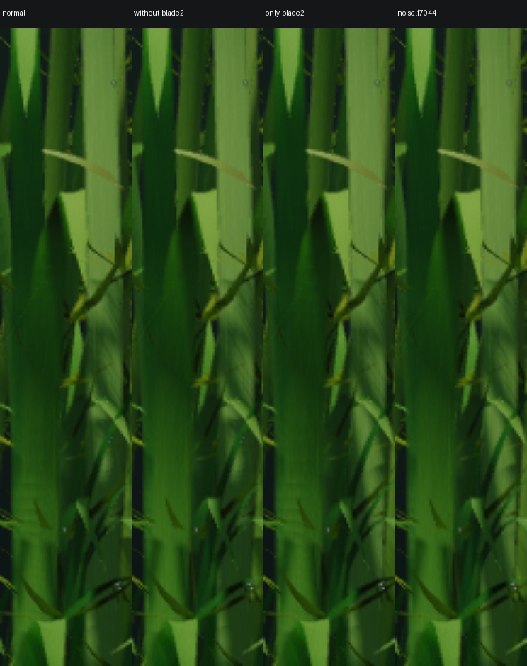
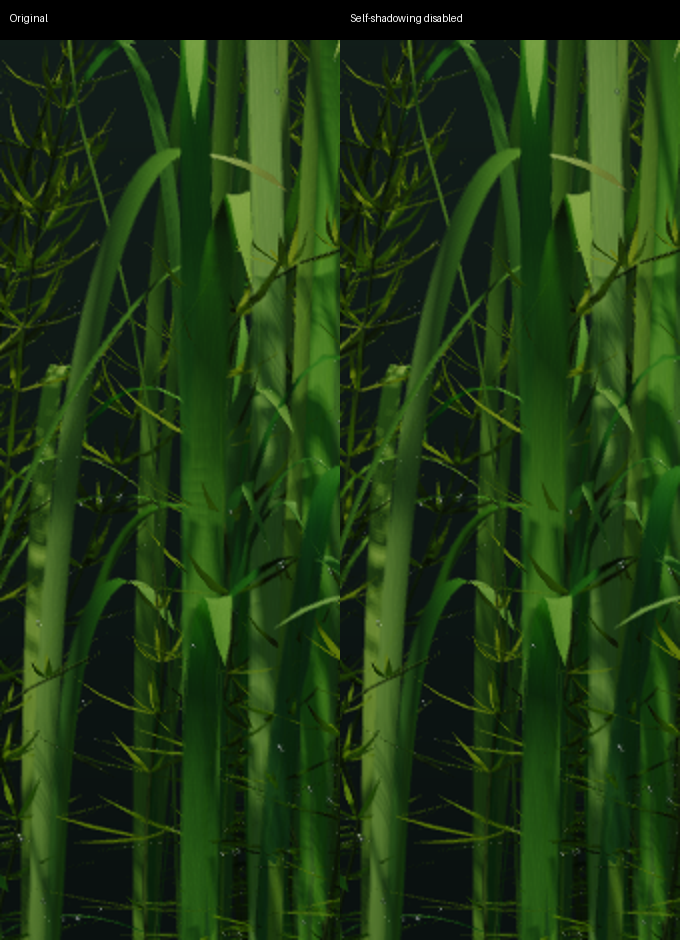

# Moving bands on a ribbon leaf

The two-offset-view trial exposed broad dark bands travelling up a bending tall
leaf. Matched frozen-time ablations isolate the bands to that blade casting onto
itself. This is not a grain-coordinate scroll. Thin ribbon blades now omit their own shadows by default, as an explicit
rendering approximation. Shadows cast by other blades and objects remain.

The public asset groups foliage identity by attachment root. Plant identity
7044 contains ten distinct blades, each with 63 vertices. The visible target is
the second blade, original vertex indices [192092,192155), with 80 triangles.
Those numbers are diagnostic provenance, not a proposed special case in the
renderer. Removing an entire plant identity was not sufficient to identify
self-shadowing; the blade-level ablations establish it.

At time 14, the 18×55 band crop differs from the clump-disabled reference by
4.553 RGB levels on average in the normal render, 0.059 when just the visible
blade stops casting, and 4.491 when that blade is the only caster retained within
its clump. Other plants remain ordinary shadow casters in both blade tests.

Disabling grain, veins or animated shading-normal adjustment does not remove the
bands. They occur in paused captures with a freshly rendered shadow map, so the
16 Hz shadow refresh cadence is not needed to produce them. A receiver-plane
PCF correction, exact per-texel comparisons and footprint bias only partly alter
the bands. A softer-light approximation changes other shadows noticeably.
Changing ribbon-wave spatial frequency changes the current motion. Neither was
adopted as an unqualified fix.

An independent CPU diagnostic finds actual self-intersections of light rays with
the deformed blade mesh. It uses shader-equivalent geometry and a float32 phase
seed, not GPU geometry readback: floating-point shader differences mean it is
supporting evidence, not an exact pixel certificate. Shadow-filter comparisons
alone cannot distinguish true geometric self-occlusion from sampling errors.

## Applied policy

Connected ribbon meshes receive separate stable identities at asset load. This
uses the existing vertex binding word; it does not duplicate geometry or identify
an entire ten-blade plant as one leaf. Broad leaves and ordinary objects retain
the previous behavior.

The light map stores its nearest caster identity alongside depth. A second depth
pass skips that identity, retaining the nearest different caster. At each shadow
filter texel, a ribbon receiver selects this second depth only when the first
caster is itself. Merely ignoring matching first-layer identities would also
lose foreign occluders hidden behind the first layer. Both layers use the same
16 Hz refresh schedule. Native texture gathers keep the existing nine bilinear
comparison taps inexpensive. Leaf motion, surface grain and lighting coefficients
are unchanged.

`--leaf-self-shadows` restores the original shading policy for comparison. The
extra shadow resources are still allocated and updated with this diagnostic flag.
The live desktop uses the accepted paired-view renderer with the new policy.
The ordinary retained renderer also disables ribbon self-shadowing by default.

At 1408×881 on the A18 Pro, sequential ten-second paired-view runs measured:

| Quantity | Previous shadows | Ribbon self-shadowing disabled |
|---|---:|---:|
| Frames / elapsed seconds | 242 / 10.0289 | 242 / 10.0477 |
| Mean GPU command duration | 23.94 ms | 27.17 ms |
| Metal allocation | 172.77 MiB | 197.02 MiB |

The added 24.25 MiB includes allocation alignment for a 2048² R16Uint identity
map and depth32F second layer. These are short cost screens including startup,
with other applications active, not GPU utilization or power measurements.
An initial manual per-texel implementation fell to about 20 fps; hardware
gathers restored the 24 fps target. The extra layer preserves foreign shadows
but this is not a physically exact self-shadowing model.

Validation: core topology/identity tests, native 2×/4× retained/full image checks,
specialized/generic comparisons, CONV smoke capture, Metal API validation and
asset checksums. The fixed-time capture removes the identified broad bands.
Raw ablation image hashes and numerical crop checks are in `evidence.json`;
`implementation-evidence.json` records the applied version and measured cost.
