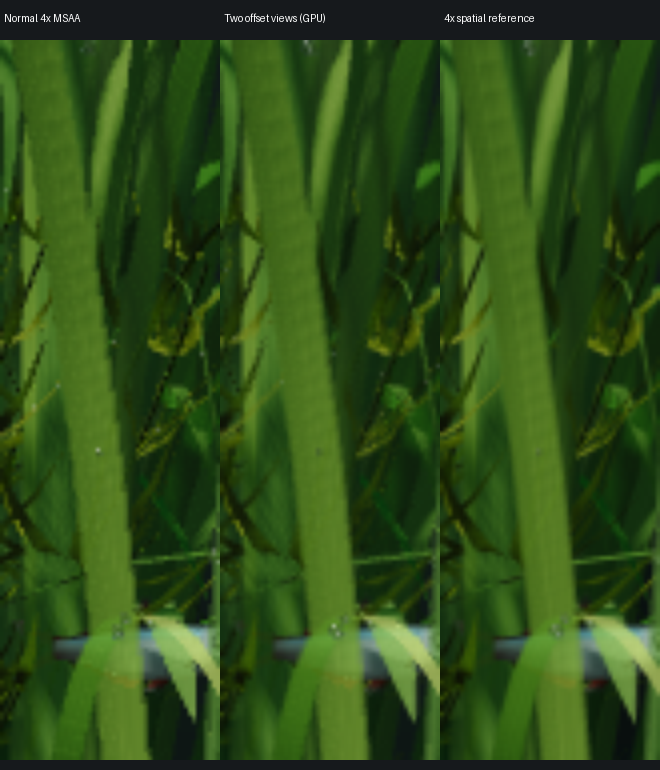

# Two offset camera views

The aquarium is rendered twice at normal output resolution, using projection
offsets of (-0.25,-0.25) and (+0.25,+0.25) pixels. Each view uses ordinary 4×
MSAA. A GPU pass averages their resolved colors. The two views share scene
geometry, textures, actors, animation time and shadows. No previous frame is
involved, so this does not introduce temporal history or fish-motion ghosting.

This is an isolated, live quality trial. The current reproduction includes the
[per-blade self-shadow suppression](../leaf-shadow/README.md); the original AA
comparison and timing table below predate that change. The production default remains the
accepted retained renderer with 4× MSAA.



The troublesome leaf edge is smoother in the two-view result, though some
stepping remains and the image is not equivalent to the high-resolution
reference. These are matched 55×180 crops, enlarged identically with bilinear
interpolation. The diagnostic disables leaf grain and pauses at time 8. The
right reference uses 4× spatial magnification in each axis, plus 4× MSAA, then
box-downsampling. The running trial and performance measurements enable the
accepted leaf grain.

## Local cost screen

A18 Pro MacBook Neo, 8 GiB, 1408×881, 24 fps cap, two sequential ten-second
animated runs with the extra aquarium process stopped:

| Measured quantity | Ordinary retained 4× MSAA | Two offset 4× MSAA views |
|---|---:|---:|
| Frames / recorded wall duration | 242 / 10.089 s | 241 / 10.031 s |
| Frames / recorded wall duration | 23.99 fps | 24.03 fps |
| Mean measured GPU command duration | 19.77 ms | 24.27 ms |
| Metal allocated storage | 244.58 MiB | 172.77 MiB |

This trial held the target frame rate with approximately 23% more measured GPU
command time and 29% less Metal allocation in this comparison. It uses **two full
redraws**, bypassing the retained camera registry; that change accounts for the
storage reduction. It does not claim to preserve the retained rendering path.
The second camera render repeats geometry rasterization and material shading,
while simulation, uploads and shadow generation are shared. The two resolved
color textures together require about 9.75 MiB of allocated storage on this
machine, based on the difference from the single full-redraw control.

These short runs include startup. Other applications remained active, so these
are cost screens rather than a power, utilization or thermal certification. Two
earlier paired runs also held 24 fps at 23.27–24.44 ms; the ordinary renderer
varied more (19.29–33.20 ms) with the extra aquarium running. Preserve that
variation rather than selecting only favorable data. All raw runs are recorded
in `evidence.json`.

## Validation and limits

- The GPU average agrees with averaging independent offset captures within
  1/255 per RGB channel (expected intermediate RGB8 rounding).
- Repeated fixed-time GPU captures are pixel-identical.
- The native capture ran with Metal API validation enabled.
- The isolated reproduction script builds and runs successfully.
- Default renderer 2×/4× retained/full and specialized/generic comparisons passed
  during this work. They validate the unchanged default path, not paired-mode
  cache correctness: paired mode deliberately bypasses those caches.
- Colors are averaged in the application's existing display-color convention,
  matching the preceding downsample comparison. This is not a physically linear
  radiance integration claim.
- Eight geometric coverage samples are distributed across two pixel footprints;
  this is not identical to hardware 8× MSAA or 64-sample spatial supersampling.
  There are also two material evaluations per pixel/triangle rather than one.
- The isolated renderer requires `--full-redraw` and ordinary MSAA. Its retained
  and CONV combinations are rejected. Do not use the retained verification
  harness on the experimental app.
- Full-scene motion quality, brightness/detail preferences and sustained battery
  cost still require evaluation before promotion. The experiment has no menu
  toggle for switching AA modes and does not alter the default application.

## Reproduce

From a complete clone on a Mac with CMake, the Apple C++ toolchain, Python 3,
`git`, `tar` and `patch`:

```sh
python3 experiments/paired-view/run.py
```

The script exports base commit `0cbdc5bbd149942cd87e5160470f03a0a5027fc4`,
applies `prototype.patch` only to the exported copy, builds a separate app,
checks repeated fixed-time captures and records a short animated run. It never
edits the working renderer or normal app bundle. `--output` selects a new
artifact directory, `--seconds` sets the animated duration, and `--build-only`
omits native runs. Fetch history first if the base is unavailable in a shallow
clone. Dimensions follow the local display.

To run the resulting trial continuously with the usual sound:

```sh
./artifacts/paired-view-reproduction/build/Stillwater.app/Contents/MacOS/Stillwater --desktop --full-redraw --msaa 4
```

Quit the other aquarium first to avoid duplicated sound and GPU work. Quit the
trial from its usual menu-bar control. Relaunch `build/Stillwater.app` to return
to the ordinary renderer. Neither app changes system wallpaper or login items.
