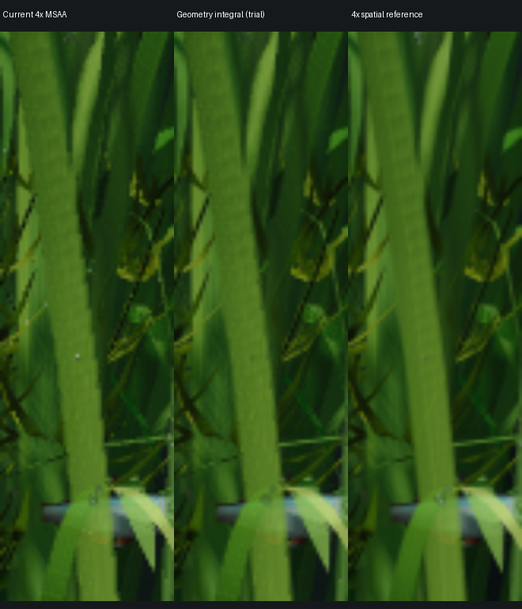

# Pixel visibility integration trial

This experiment improves the serrated leaf silhouette without increasing the
output framebuffer resolution. It is **not fast enough for the desktop default**.
It tests 64 geometric visibility positions per pixel and shares material shading
between them. It is numerical quadrature, not exact analytic integration, and
still does substantial sampling work.



Left: normal 4× MSAA. Middle: 8×8 visibility quadrature at normal output size.
Right: 4× spatial magnification in each dimension, with 4× MSAA, box-downsampled.
All are paused at time 8 with leaf grain disabled to isolate the edge. Each crop
is 55×180 output pixels, displayed with the same bilinear enlargement. The trial
softens the conspicuous steps and more closely resembles the reference, but it
has not reproduced all its surface detail or been accepted as visually equivalent.

## Method

1. Reuse CONV's prepared geometry and conservative support rasterization, but
   include every camera-intersecting candidate triangle, not just silhouettes.
2. Store projected triangle edges and affine depth once per triangle.
3. Evaluate the material once per triangle/pixel contribution. Store RGB, alpha,
   triangle ID and a linked-list pointer in a 16-byte record.
4. Resolve 64 stratified positions inside each output pixel. At each position,
   apply a shared Bayer alpha-coverage mask, test triangle membership and choose
   the nearest depth. Use stable primitive order for exact depth ties.
5. Average the selected colors. One 32-lane SIMD group handles a pixel, with two
   visibility positions per lane. Atomic append order does not determine color.

The shared coverage mask matters: independent masks per leaf changed the look
of overlapping foliage substantially. This mask approximates the existing
alpha-to-coverage behavior; it is not a physical transmission calculation.

The current implementation shades hidden contributions too. The fixed scene
produced 16,266,275 contribution records and as many as 543 contributions in one
pixel. This is the main architectural problem to solve before considering
promotion: resolve visibility before expensive material evaluation and avoid
storing every hidden contribution. Simply parallelizing the same work is
insufficient. No per-stage timing was collected, so this is an architectural
cost diagnosis, not a measured attribution of all GPU time to one stage.

## Measured result

On the A18 Pro MacBook Neo at 1408×881, leaf grain disabled, nominal 24 fps cap:

| Eight-second animated run | Normal 4× MSAA | Integration trial |
|---|---:|---:|
| Frames / recorded wall duration | 193 / 8.087 s | 35 / 8.294 s |
| Frames divided by recorded wall duration | 23.86 fps | 4.22 fps |
| Mean measured GPU command duration | 23.15 ms | 248.63 ms |
| Metal allocated storage | 244.58 MiB | 708.11 MiB |

These short runs include startup, have different animation sampling due to their
frame rates, and ran with the ordinary aquarium desktop process still present.
They are cost screening, not isolated steady-state performance certification.
GPU command duration is neither GPU utilization nor power consumption. The
existing metrics call the candidate count `conv_boundary_triangles`, even though
this experiment includes all candidates. `conv_storage_bytes` excludes the new
experimental buffers; use `gpu_allocated_bytes` for the complete measured Metal
allocation. Raw measurements and image hashes are in `evidence.json`.

A serial resolver and the SIMD resolver differed by at most 1/255 in any channel,
with mean difference 0.000003493/255. Two independent fixed-time SIMD captures
were pixel-identical. There is no claim of motion or all-camera equivalence.

## Reproduction

From a complete clone on a compatible Mac:

```sh
python3 experiments/pixel-integration/run.py
```

Requires CMake, a C++20 Apple toolchain, Python 3, `git`, `tar` and `patch`.
The script exports the recorded base revision into a **new** artifact directory,
creates separate baseline and experimental app bundles, applies the patch only
to that exported source, and records fixed-time captures plus short animated
runs. It never edits the checkout's renderer or normal app bundle. `--output`
selects a new directory; `--build-only` omits native runs. The base revision is
`0cd481f6d42435855801d615c15ef84ad4178228` and must be available locally (fetch
history if using a shallow clone). Fixed-time capture pixels depend on display
size; the recorded crop assumes 1408×881.

For the displayed reference, the earlier diagnostic transformed camera clip
coordinates as follows before rasterization:

```cpp
clip.xy = 4 * clip.xy + float2(1.863636363636, -1.547105561862) * clip.w;
```

It used the original mesh, full redraw, 4× MSAA, time 8, and disabled leaf grain.
Crop normal images at (230,180)–(285,360). Crop the reference at
(120,80)–(340,800), then box-downsample to 55×180. This diagnostic reference is
local spatial magnification, not a performance measurement of a 4× whole tank.
The runner reproduces the two whole-frame paths, not that earlier diagnostic.

## Limits and guardrails

- This is an isolated research patch, not a new supported production AA option.
- The 24-million-record capacity reports overflow, paints invalid output magenta
  and rejects PNG capture. The runner checks that a capture exists and that its
  logged overflow count is zero. No overflowed result is accepted as an image.
- The inherited camera classifier omits near-plane-crossing triangles. The trial
  is restricted to the tested camera; it is not a general replacement renderer.
- Material color and alpha are evaluated once at the pixel shading location,
  which may lie outside the covered triangle. Texture derivatives, nonlinear
  lighting and subpixel texture detail are not integrated at all 64 positions.
- Background and display-space color averaging follow this application's
  existing conventions; this is not a physically linear radiance integral.
- Shared alpha masks are an approximation. Real transmittance and the hardware
  alpha-to-coverage sample pattern need separate validation.
- Buffer records use global GPU memory, not tile-local image blocks. The resolver
  explicitly requires 32-lane SIMD groups and rejects unsupported widths.
- Default production remains 4× MSAA with the accepted leaf grain. The only
  production fix accompanying this experiment forwards the leaf-grain texture
  to the existing optional CONV fragment shader after its shading signature changed.
